# Veritas B2B - Data Flow Diagrams

**Version**: 1.0.0
**Format**: Mermaid
**Last Updated**: 2026-03-08

---

## 1. System Context Diagram

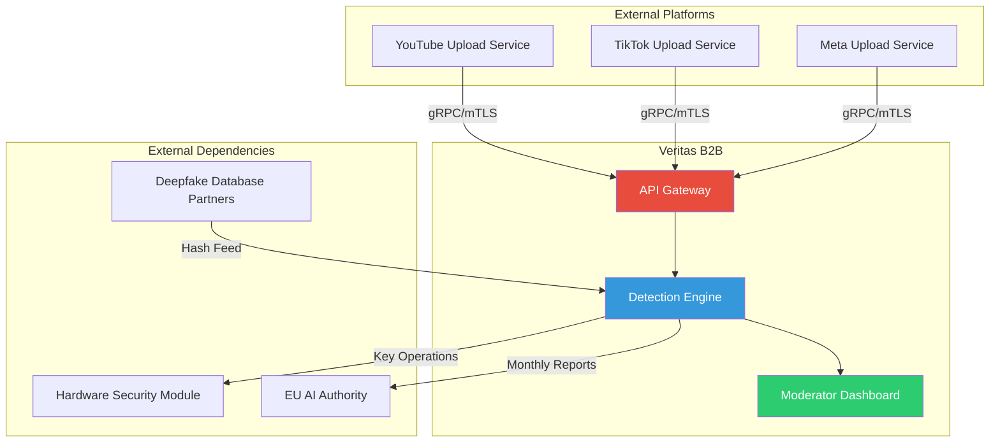

---

## 2. High-Level Data Flow

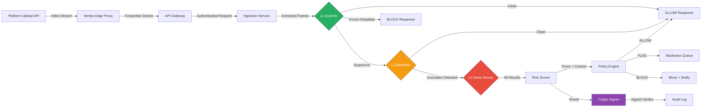

---

## 3. Detailed Ingestion Flow

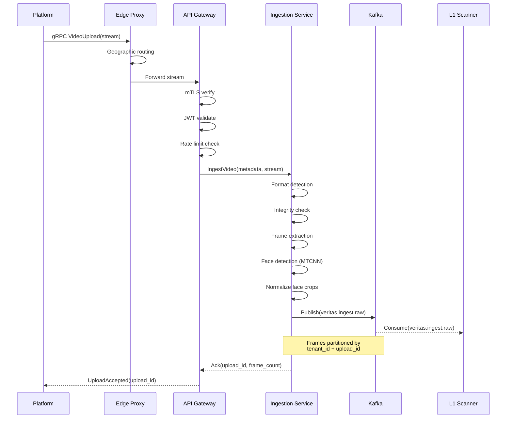

---

## 4. Multi-Stage Detection Flow

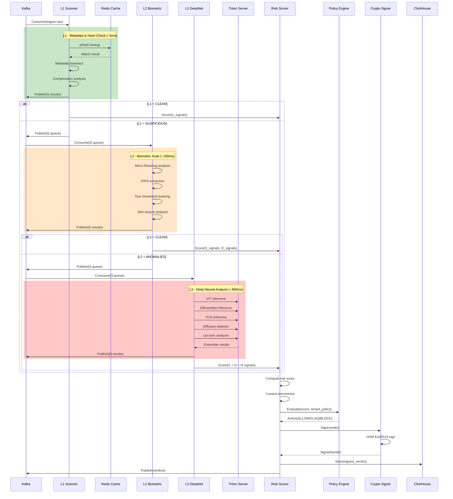

---

## 5. Cryptographic Signing Flow

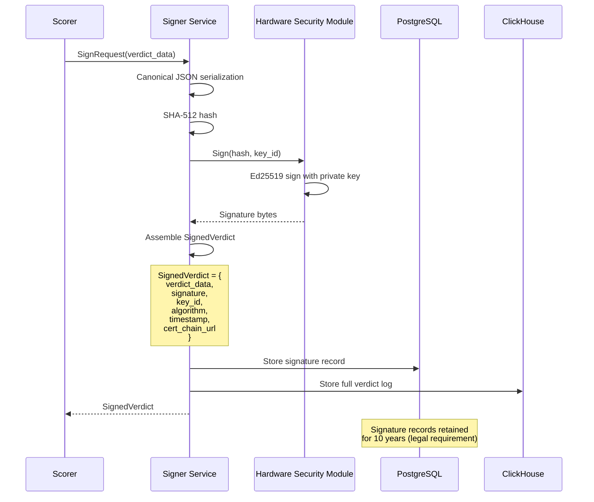

---

## 6. Zero-Retention Biometric Data Flow

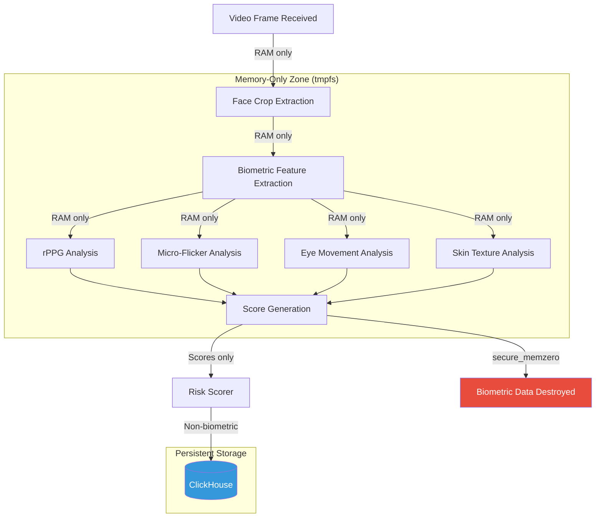

---

## 7. Compliance Event Flow

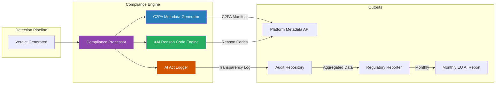

---

## 8. Moderator Dashboard Data Flow

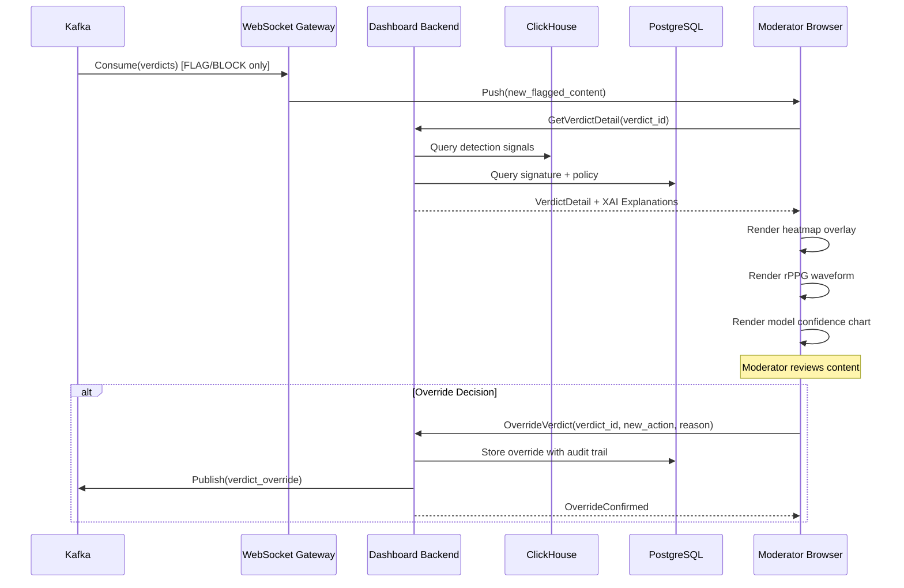

---

## 9. Autoscaling Decision Flow

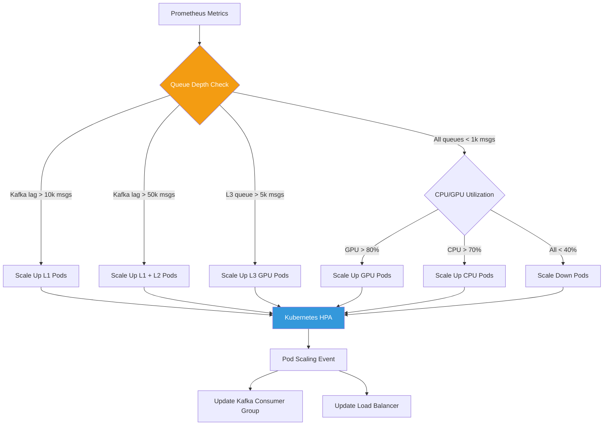

---

## 10. Red Team Sandbox Flow

```mermaid
flowchart LR
    subgraph "Isolated Network"
        RT[Red Team Client] -->|Adversarial Samples| SB[Sandbox Gateway]
        SB --> SBL1[Sandbox L1]
        SB --> SBL2[Sandbox L2]
        SB --> SBL3[Sandbox L3]
        SBL1 --> SBS[Sandbox Scorer]
        SBL2 --> SBS
        SBL3 --> SBS
    end

    subgraph "Production"
        PROD[Production Pipeline]
    end

    SBS --> RPT[Attack Report Generator]
    RPT --> VULN[Vulnerability Assessment]
    VULN -->|Manual Review| PROD

    style RT fill:#e74c3c,color:#fff
    style SB fill:#f39c12,color:#fff
    style PROD fill:#27ae60,color:#fff

    Note over RT,SBS: Complete network isolation<br/>No production data access<br/>Separate model copies
```

---

## 11. Global Edge Network Topology

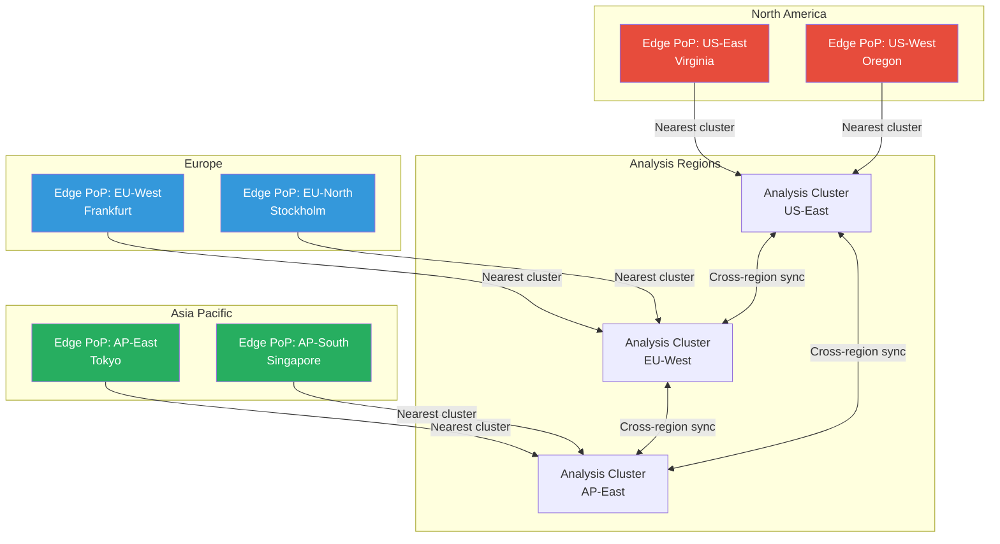

---

## 12. End-to-End Request Lifecycle

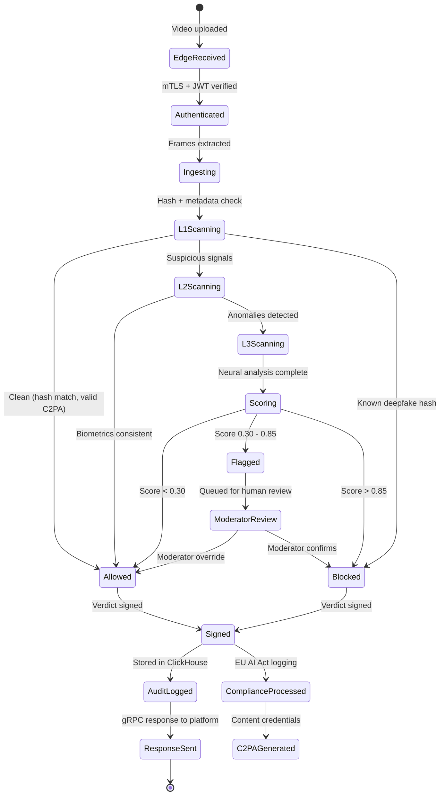

---

## 13. Kafka Topic Dependency Graph

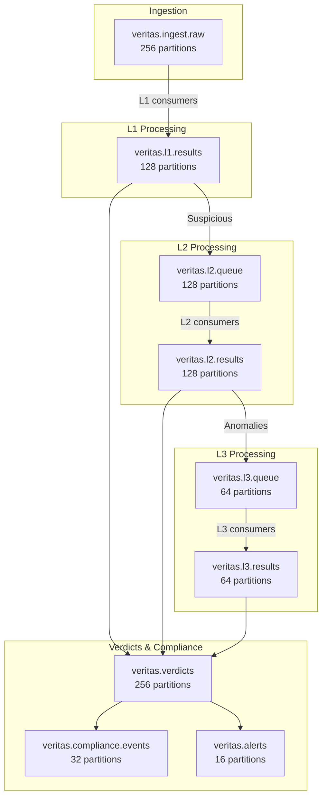
